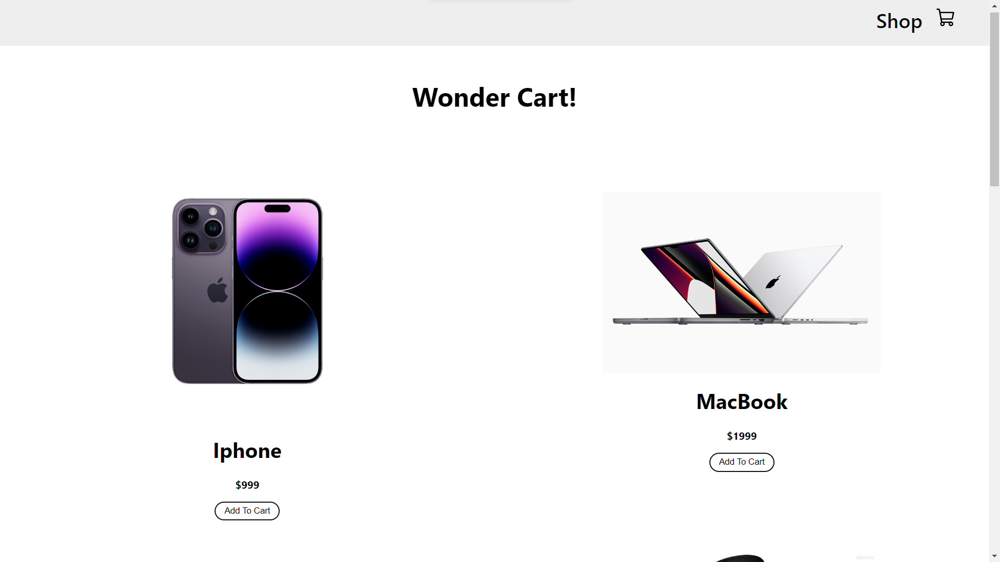
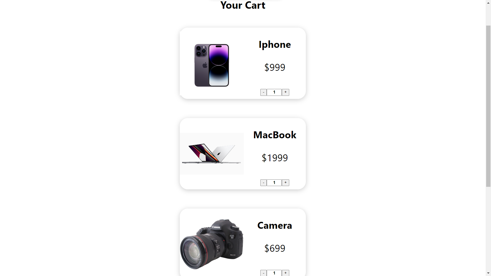

# Wonder Cart

Wonder Cart is a simple shopping cart application built with React.js, HTML, and CSS. This application allows users to browse a list of products, add them to a cart, and adjust the quantities in the cart. It also calculates the total price of the items in the cart.





## Demo

You can check out the live demo of Wonder Cart deployed via Vercel: [Wonder Cart Demo](https://wonder-cart.vercel.app/)

## Technologies Used

- React.js
- JavaScript
- HTML
- CSS

## Features

- Browse a list of products
- Add products to the cart
- Adjust the quantity of products in the cart
- Calculate the total price of items in the cart

## Getting Started

To run this project locally, follow these steps:

1. Clone the repository:

```bash
git clone https://github.com/AryanGupta27/shopping-cart.git
```
-Navigate to the project directory:
```bash
cd shopping-cart
```
-Install the required dependencies:
```bash
npm install
```
-Start the development server:
```bash
npm start
```
The application should now be running on http://localhost:3000.

## Usage
1) Visit the application in your web browser.
2) Browse the list of products.
3) Click the "Add to Cart" button to add products to your cart.
4) Adjust the quantity of items in the cart using the provided controls.
5) The total price of the items in your cart is automatically calculated.

## Contributing
If you'd like to contribute to this project, please follow these guidelines:

1) Fork the repository.
2) Create a new branch for your feature or bug fix.
3) Make your changes and ensure the code style is consistent.
4) Test your changes.
5) Commit your changes with a clear and descriptive message.
6) Push your branch to your fork.
7) Submit a pull request.

## License
This project is licensed under the MIT License - see the LICENSE file for details.

